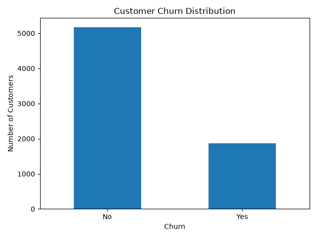
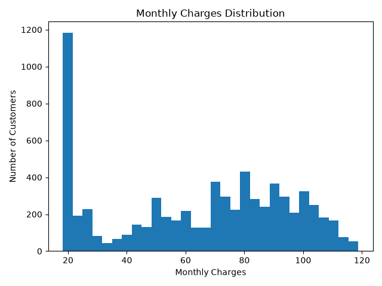
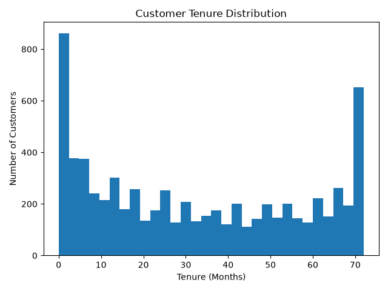
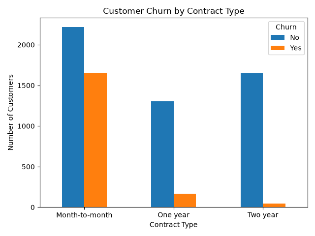
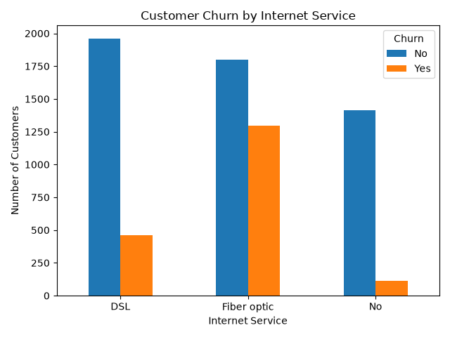
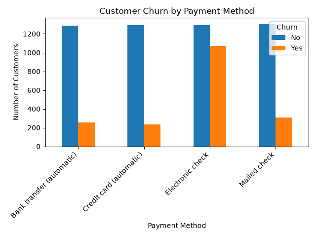
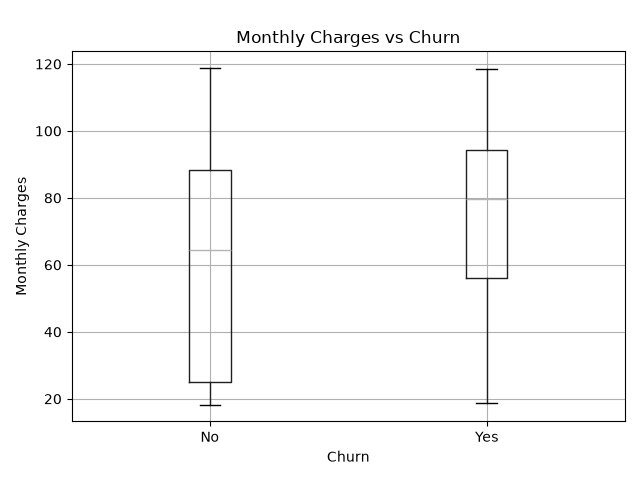
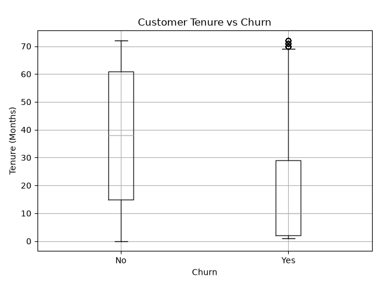
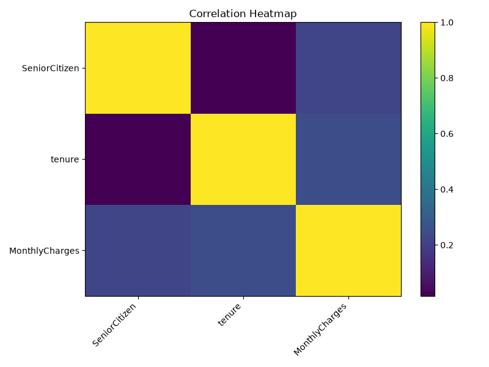
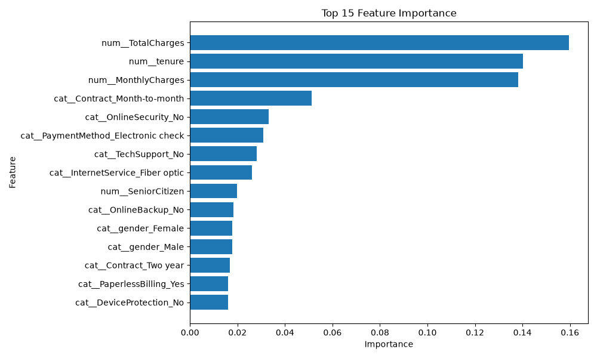

# Customer Churn Prediction & ML Deployment

An end-to-end Machine Learning project that predicts whether a customer is likely to churn based on customer, service, contract, and billing information.

## 🚀 Project Overview

This project uses Machine Learning to predict customer churn and provides a REST API and web interface for real-time predictions.

## 🛠️ Tech Stack

- Python
- Pandas
- NumPy
- Scikit-learn
- XGBoost
- Random Forest
- FastAPI
- Streamlit
- Docker
- Git & GitHub
- Render
- Streamlit Community Cloud

## 🏗️ Architecture

Dataset
↓
Data Preprocessing
↓
Feature Engineering
↓
Train/Test Split
↓
Random Forest Model
↓
Model Evaluation
↓
Saved ML Pipeline
↓
FastAPI REST API
↓
Streamlit Web Interface
↓
Docker Deployment

## 📊 Machine Learning

Model: Random Forest Classifier

The preprocessing pipeline includes:

- Missing value handling
- Numerical feature processing
- Categorical feature encoding
- One-Hot Encoding
- Train/Test Split

Model evaluation is performed using:

- Accuracy
- Precision
- Recall
- F1-Score
- Classification Report

## ⚡ Features

- Customer churn prediction
- Churn probability
- Customer information analysis
- Billing information analysis
- REST API using FastAPI
- Interactive Streamlit interface
- Docker containerization
- Cloud deployment

## 🌐 Deployment

### FastAPI

Deployed using Render.

API Documentation:
https://customer-churn-ml-qcdw.onrender.com/docs

### Streamlit

The Streamlit application provides an interactive interface for entering customer details and receiving churn predictions.

## 🐳 Docker

Build Docker image:

```bash
docker build -t customer-churn-api .
## 📊 Model Evaluation

- Accuracy: 78%
- Algorithm: Random Forest Classifier
- Evaluation Metrics:
  - Accuracy
  - Precision
  - Recall
  - F1-Score
  - Confusion Matrix

## 📈 Exploratory Data Analysis
## 📊 EDA Visualizations

### Customer Churn Distribution



### Monthly Charges Distribution



### Customer Tenure Distribution



### Churn by Contract Type



### Churn by Internet Service



### Churn by Payment Method



### Monthly Charges vs Churn



### Tenure vs Churn



### Correlation Heatmap



### Feature Importance



The project includes EDA for:

- Customer Churn Distribution
- Monthly Charges Distribution
- Tenure Distribution
- Categorical Feature Analysis

## ⭐ Feature Importance

Feature importance analysis is performed using the trained Random Forest model to identify the most influential factors affecting customer churn.

## 🐳 Docker

Build the Docker image:

```bash
docker build -t customer-churn-api .